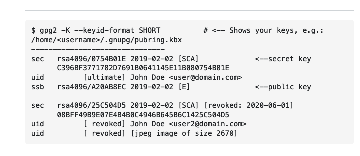

## Problem
I was attempting to detangle issues with my git. I noticed the following error.

I couldn't understand what was going on with my key. Turns out it was using another key of mine that was old.

## Solution
* I ran `gpg2 -K --keyid-format SHORT`
This showed me a list of keys. I found the email and key associated with my account 

* I took my ID and ran
 `git config --global user.signingKey 2379CAAE`

* then I checked the key being used by running  `git config --global user.signingKey`

Once everything checked out, I was able to push once again to my repo.

