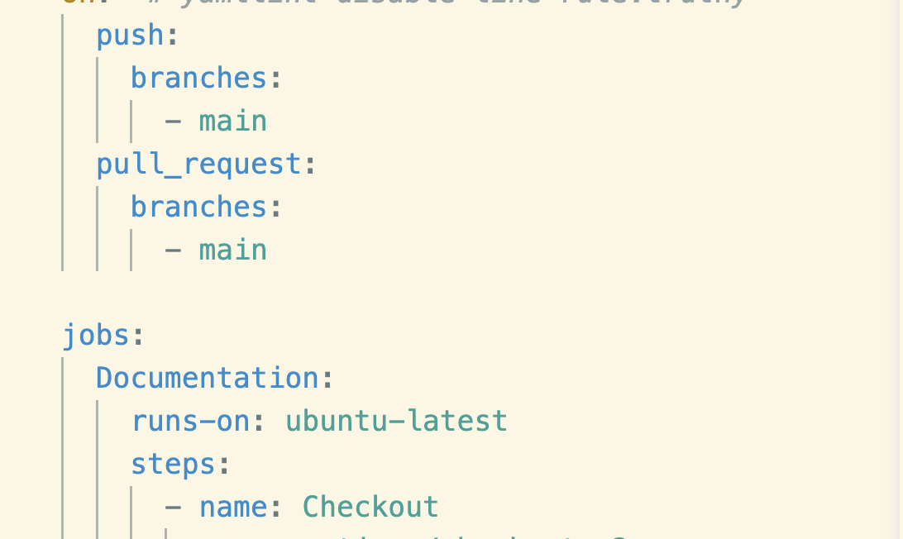

## Problems
### Problem 1 - Jinja
I use mkdocs to serve the content I create into the website that you're currently on.

I write my documents within VS Codium in markdown. I run `mkdocs serve` to get a preview of the content on the web. Then I go through the git flow to push to my repo.

 I was trying to push to my site and I got an error on my mkdocs with outdated items. My jinja was outdated. 
 

 ### Problem 2 - Ubuntu 

My terminal was stating that I had an outdated version of Ubuntu. At first I was confused because I currently am using MAC Os. I did some research within the documents for the mkdocs

* cinder-1.2.0
* mkdocs.yml
* requirements.txt
* .github & others

 ## Solution 1 - Jinja
I ran the command  `pip install jinja2==3.0.0` this resolved my issue and my mcdocs worked again. 

Resource used [here](https://github.com/mkdocs/mkdocs/issues/2799)

## Solution 2 - Ubuntu
I corrected the `runs-on` variable in my build.

Changing this to latest. The reason that I used latest is because I didn't want to have to worry about each version released.

It should be noted that there an is debate overall with using tag `latest`.  Your documentation doesn't tell you what tag you're at and you wont know how to roll back if it fails. Hence, use with caution.