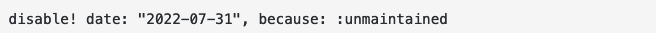

## Problem
I was set to work with terraform for the first time on my machine (mac OS) but I could not get the terraform binary to work. The reason for this is that I needed to download is at an earlier version to match my colleagues. 

## Solution
I ran: `brew install terraform@0.13.1` and this provided me with the error that it was disabled because it was an older version.


So I then ran`brew edit terraform@0.13` this got me to a vim page with details on the dependencies, I removed the line that included `disable! date: "2022-07-31", because: :unmaintained`




I attempted to install once more.  That did not work.

I installed the binaries [here](https://releases.hashicorp.com/terraform/0.13.1/). 

Then I attempted to execute it but it did not work. 

I went to the downloads folder where the binary was located and I was able to run `terraform -vrsion`. 

So I had to move this binary to my path where my executables reside.

I ran `echo $PATH` and I got a list of all the places my system will look when attempting to run a binary, so because the terraform binary was in my downloads I ran

```
mv terraform /Users/ash/.docker/bin 
```

Then I was able to run `terraform -version` and had output! Problem solved!

### Resource 
[This write up helped me along the way.](https://stackoverflow.com/questions/73586208/can-you-install-disabled-homebrew-packages)

